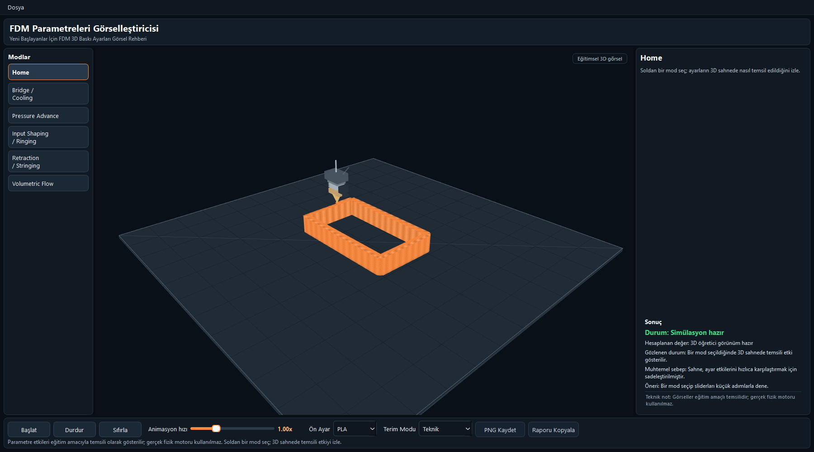
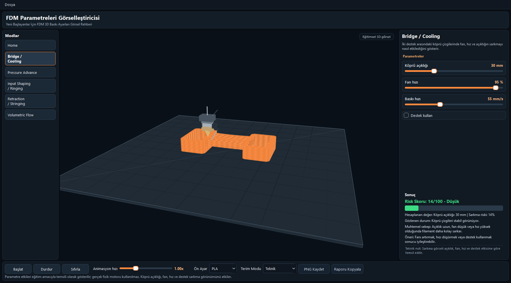
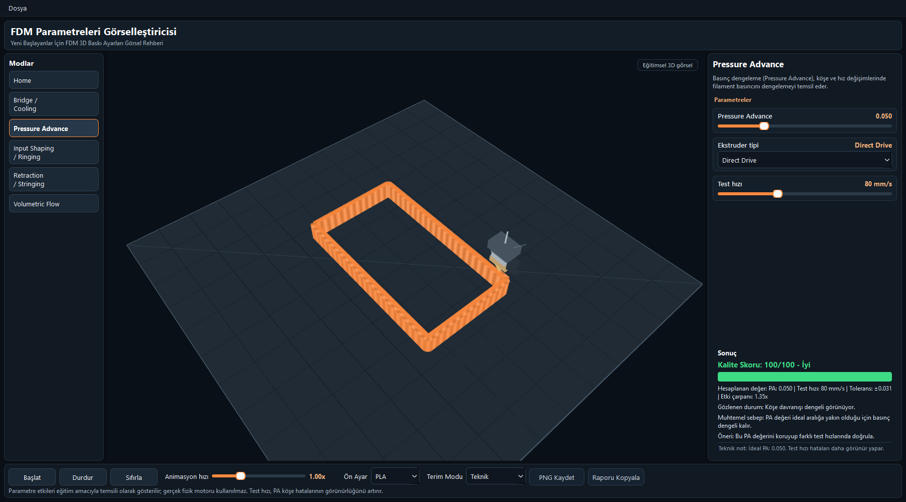
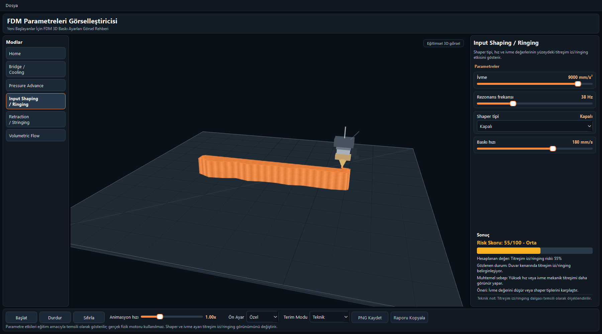
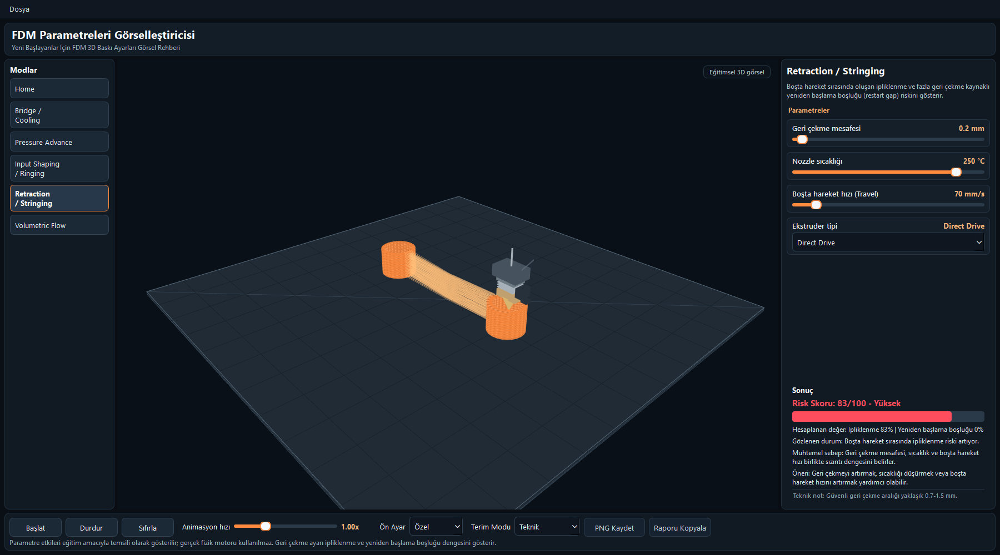
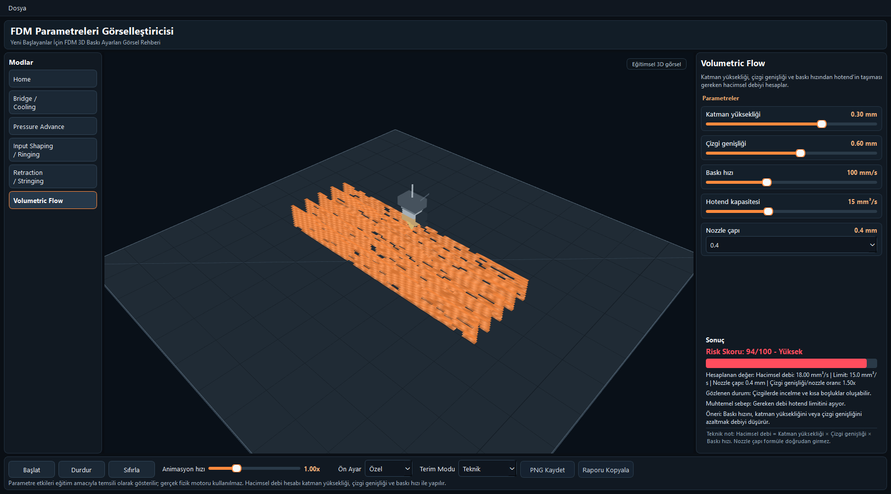

# FDM Simulator

FDM Simulator is an interactive desktop application for exploring common FDM 3D printing behaviors. It helps users experiment with print parameters and see how those choices affect bridging, pressure advance, ringing, stringing, and volumetric flow.



## Highlights

- Interactive 3D print scene with animated toolpath visualization
- Technical and explanatory terminology modes
- Material presets for PLA, PETG, ABS, and custom settings
- Mode-specific controls for practical print tuning scenarios
- Quality and risk scoring for different print behaviors

## Quick Start

```bash
python -m venv .venv
.venv\Scripts\activate
pip install -r requirements.txt
python FDM-simulator.py
```

## Screenshots



Bridge and cooling settings show how span length, fan speed, print speed, and support choices affect sagging risk.



Pressure Advance mode demonstrates how extrusion compensation changes corner quality.



Input Shaping mode visualizes ringing artifacts caused by motion and resonance settings.



Retraction mode shows how travel movement, temperature, and retraction distance influence stringing.



Volumetric Flow mode highlights the relationship between layer height, line width, print speed, and hotend capacity.
